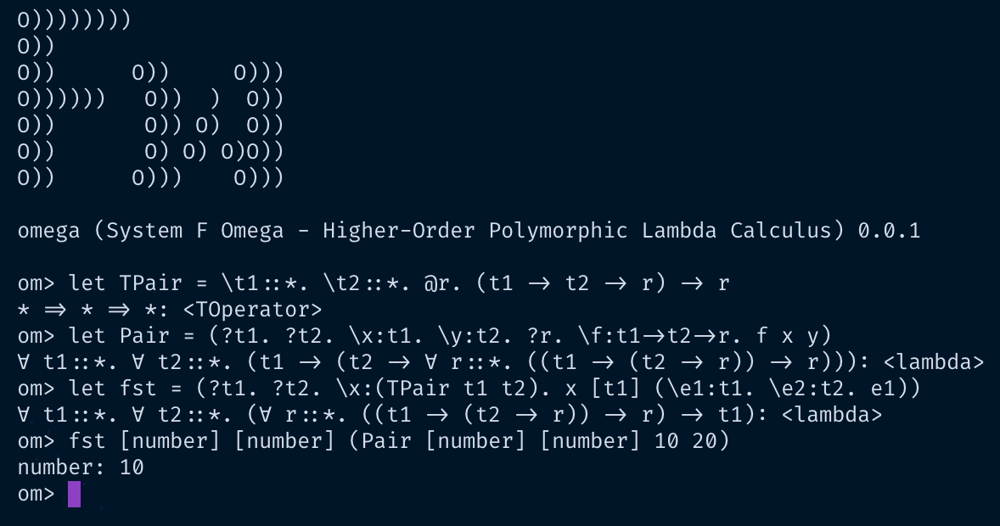

<h3>Higher Order Lambda Calculus</h3>

System F Omega Calculus. This implements Let bindings, if-then-else, numeric/boolean operators, Polymorphic Lambdas, Type operators, Higher-Kinded types etc.

## REPL

